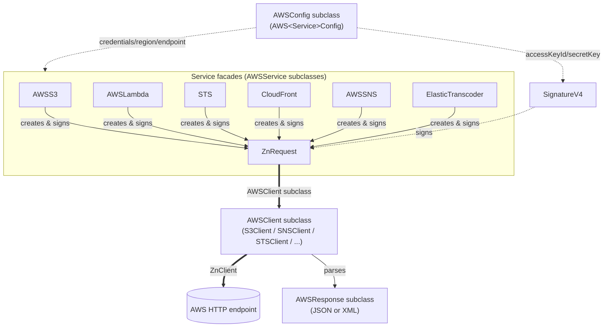

# Architecture

A Pharo client for AWS built on Zinc (`ZnClient`) HTTP and a hand-rolled
Signature Version 4 implementation — no UFFI, no generated code.

## Design overview

- **Facades wrap services; clients wrap HTTP.** Each service has a facade
  (`AWSS3`, `AWSLambda`, `STS`, `CloudFront`, `ElasticTranscoder`, `AWSSNS`,
  all subclassing `AWSService`) that builds and signs requests, and a client
  (`AWSClient` subclass, e.g. `S3Client`) that actually executes them over
  `ZnClient` and parses the response.
- **Every request is signed the same way.** All services delegate to
  `SignatureV4 creatAuthorization:andConfig:andDateTime:andOption:` — there is
  no per-service signing variation.
- **Config is per-service but shares one base.** Every `AWS<Service>Config`
  subclasses `AWSConfig`, which resolves credentials from `~/.aws/config` /
  `~/.aws/credentials` or explicit accessors (see
  [authentication.md](authentication.md)).
- **Errors are signalled, not returned**, as a single `AWSException` class
  reused by every service.

## Packages

| Package | Role |
|---------|------|
| `AWS-Core` | `AWSClient`, `AWSResponse`, `AWSService`, `AWSConfig`, `AWSException`, `SignatureV4` |
| `AWS-S3` | S3 buckets/objects; XML responses (`XMLDOMParser`) |
| `AWS-SNS` | SNS topics/platform applications; XML responses |
| `AWS-DynamoDB` | DynamoDB tables/items; JSON only |
| `AWS-Lambda` | Lambda invocation; JSON only |
| `AWS-STS` | Temporary credentials; XML responses |
| `AWS-CloudFront` | CDN invalidations; XML request and response bodies (`XMLWriter`) |
| `AWS-ElasticTranscoder` | Transcoding jobs/pipelines; JSON only |
| `BaselineOfAWS` | Metacello load definition |

Dependency graph (from `BaselineOfAWS>>baseline:`): every service package
requires `AWS-Core`; `AWS-S3` and `AWS-SNS` additionally require `XMLParser`
in the baseline (though `AWS-STS` and `AWS-CloudFront` also use XML parsing at
runtime without declaring that dependency — see "Known gaps" below). External
baselines: `JSON` (`Json-BackwardCompatibility`, actually used pervasively),
`NeoJSON` (declared, unused), `XMLParser`, and the legacy `Cryptography`
package (declared only `for: #'pharo3.x'`, but its `SHA256` is used
unconditionally by `SignatureV4` and every service).

## Class relationships

Each facade's `createRequest:url:method:` (`AWSService`'s
`subclassResponsibility`) builds the `ZnRequest`, sets AWS-specific headers
(`host`, `x-amz-date`, `x-amz-content-sha256`, optionally
`X-Amz-Security-Token`), calls `SignatureV4` to compute the `Authorization`
header, then hands the request to `self client request:andOption:`. See
`.claude/rules/rest-api-patterns.md` for the exact code, quoted from
`src/AWS-S3/AWSS3.class.st` and `src/AWS-Core/AWSClient.class.st`.

## Response handling: JSON vs XML

`AWSResponse>>value` (`src/AWS-Core/AWSResponse.class.st`) is the JSON-only
base — it parses the body with `Json readFrom:` and signals `AWSException` on
a non-success status. Services whose API returns XML (S3, SNS, STS,
CloudFront) override `value` to branch on `self response contentType sub`
instead, parsing with `XMLDOMParser` when it is `'xml'` and falling back to
raw contents otherwise (see `S3Response` in `.claude/rules/rest-api-patterns.md`).
DynamoDB and Lambda never need this override — their APIs are JSON-only.

## Error model

A single `AWSException` (`src/AWS-Core/AWSException.class.st`, subclass of
`Error`), carrying `properties` (the parsed error body, JSON or XML) and a
`message` accessor that delegates to it. Every `*Response>>value`
implementation builds and signals the same exception class via
`defaultExceptionClass` — there is no per-service or per-error-code
exception hierarchy, unlike SDKs that define one exception class per failure
type.

## Known baseline / dependency gaps

Documented here as facts, not fixed as part of adding this documentation:

- `NeoJSON` is declared in `BaselineOfAWS` but never referenced by any class
  in `src/` — only `Json`/`JsonObject` are actually used.
- `AWS-CloudFront` and `AWS-STS` use `XMLWriter`/`XMLDOMParser` at runtime but
  their package specs in `BaselineOfAWS` only `requires: #('AWS-Core')`,
  omitting `XMLParser` (unlike `AWS-S3`/`AWS-SNS`, which declare it
  correctly). Reason unknown.
- The legacy `Cryptography` package (source of the `SHA256` class every
  signing operation depends on) is declared `for: #'pharo3.x'` only, yet the
  CI matrix (`.github/workflows/ci.yml`) targets Pharo 7 through 13. Reason
  unknown — do not assume it is safe to remove or adjust without first
  confirming how `SHA256` is actually being loaded on the newer images.

## See also

- `.claude/rules/rest-api-patterns.md` — the request/response/signing pattern
  with quoted source.
- `.claude/rules/project-conventions.md` — class-prefix inconsistency,
  per-service config defaults, protocol names.
- `docs/authentication.md` — credential resolution and STS session tokens.
